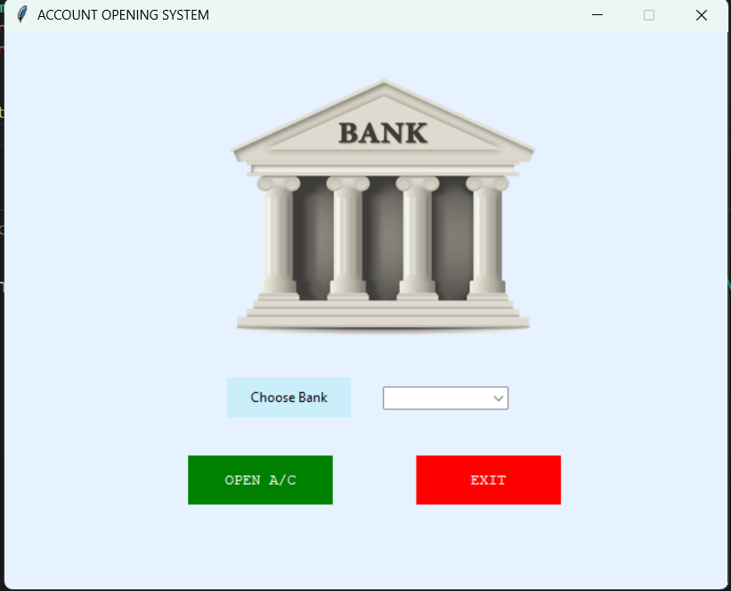
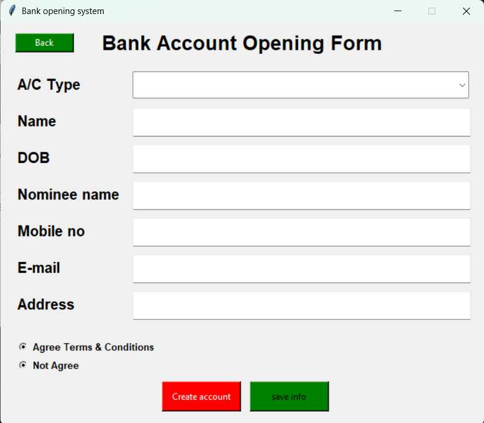
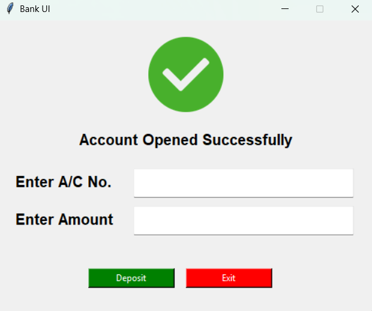

# 🏦 Bank Account Opening System

A user-friendly desktop application built using **Python Tkinter** and **MySQL** to open new bank accounts, store user data securely, and make deposits.

---

## 📌 Features

- GUI to create different types of bank accounts.
- Validates form inputs and terms & conditions.
- Automatically stores account data in a MySQL database.
- After account creation, users can make an initial deposit.
- Modern Tkinter-based interface with responsive design elements.
- Includes image support for a more visual user experience.

---

## 🚀 Screenshots

| Main Menu | Account Form | Deposit Window |
|----------|--------------|----------------|
|  |  |  |

---

## 🛠 Technologies Used

- `Python 3`
- `Tkinter` for GUI
- `MySQL` (via `mysql-connector-python`)
- `Pillow` for image support

---

## 📂 Project Structure

📁 bank-account-system/
├── main.py # Main window with bank selection
├── details.py # Account opening form logic
├── submitted.py # Deposit window logic
├── images/ # UI images (e.g., img.png, tick.png)
└── README.md

yaml
Copy
Edit

---

## ⚙️ Setup Instructions

1. **Clone the repository**:
   ```bash
   git clone https://github.com/satyam-umrao/bank-account-system.git
   cd bank-account-system
2. **Install dependencies**:

   ```bash
   pip install pillow mysql-connector-python

3. **Setup MySQL Database**:

- `Make sure MySQL is running.`
- `Create a database named bank.`
- `Ensure user credentials are correct (user='root', password='root' by default).`
- `Tables bank_accounts and deposit_money will be auto-created.`

4. **Run the App**:
    ```
    python main.py
## 🧠 Functionality Breakdown

- `main.py – Main dashboard with bank selection.`
- `details.py – Account form with:`
    - `Name, DOB, Mobile, Email, Nominee, Address, Account Type.`
    - `T&C checkbox validation.`
    - `Data is inserted into bank_accounts table.`

## submitted.py – Deposit window:

- `Deposit amount into the newly created account.`
- `Data stored in deposit_money table.`

## 🙋‍♂️ Group project
Developed by `Satyam Umrao`, [Sanchit](https://github.com/Sanchitumrao) and [Saurabh Yadav]()


---
